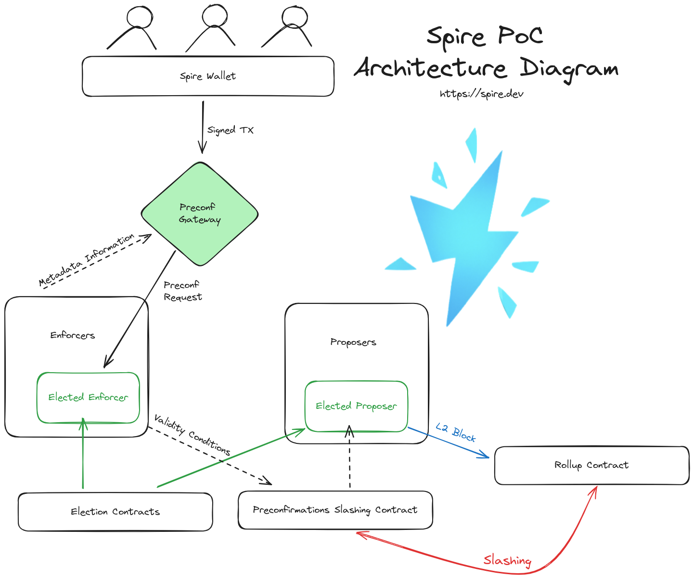

# poc-monorepo

## Direcotry Structure

All paths are relative to the root of the repository.

- `apps` contains all components (enforcer, gateway-api, proposer, wallet). For example,
  - `apps/proposer` has everything you need to run a proposer
  - `apps/proposer/src` contains the Rust code
  - `apps/proposer/contract` contains _compiled_ contracts (`.json`) required by the Rust code
  - `apps/proposer/docker-compose.yml` is the standalone docker-compose file you can use to spin up the proposer in Docker engine. Alternative you can run it locally with `cargo run` from within `apps/proposer` directory.
- `apps/wallet` contains a React app that acts as a wallet from the end user's perspective.
- `packages` contains things that will be changed less frequently, including all the smart contracts. For example,
  - `packages/poc-election-contract` contains everything you need to compile the election contract
  - `packages/poc-election-contract/src` contains the Solidity code
  - `packages/poc-election-contract/lib` contains all `forge` dependencies required to compile the contract
  - `packages/poc-election-contract/test` contains unit tests for the contract
  - `packages/poc-election-contract/out` contains the compiled contract (`.json`), which we will need to copy over to `apps/proposer/contract` whenever we make changes to the contract.
- `packages/spvm-rs` contains the Rust version of the Spire Virtual Machine, which is used by the enforcer to validate the execution of preconfirmation transactions it receives, before the enorcer submits them (validity conditions) to the slashing contract.
- `scripts` contains all the scripts required to setup the local Anvil environment, deploying contracts to local Anvil, Flask server (for contract addresses), utils, etc.
  - `scripts/demo_setup_script.py` is the main script that sets up the local Anvil environment, deploys contracts, and populates them with initial data.
  - `scripts/setup_and_run.sh` is the script that installs all dependencies for the projects, spins up a Python virtual env, and then executes `demo_setup_script.py`. If you have a Mac, you can use `setup_and_run_mac.sh` instead.
  - `scripts/utils` contains useful scripts you can call from the command line, written in Rust. It is it's own Cargo project, so you can run `cargo run --bin script_name` from within `scripts/utils` to run the utility functions. See `scripts/utils/Cargo.toml` for all available utility script names.

Spire PoC Monorepo!

[Poc Spec](https://www.notion.so/spirelabs/Spire-Based-Stack-PoC-45ecd6a1afa44f8c8f28f086b42b08c5)

[General PoC](https://www.notion.so/spirelabs/Spire-PoC-Infrastructure-9caebb8915f24a1fba9caf1365b05737)

TODO (megan):

- [x] finish creating a shared docker-compose.yml for all rust executables in monorepo (they live in the apps directory)
- [x] set up github actions for PRs and pushes to main
- [x] add .dockerignore files to apps to speed up build process
- [x] test out functionality with hosted Anvil instance
- [x] add Spire wallet/poc-infra/smart contracts to monorepo (useful commands for this include `rm -rf .git` inside the folder for the app added, then `git rm --cached path/to/app` from parent folder, followed by `git add path/to/app`)
- [x] make sure the apps are up to date with the latest in all individual repos, announce to the team that we now build in the monorepo only
- [ ] bring env vars out of individual apps into one consolidated file?
- [ ] write additional scripts (makefile?) to spin up all apps in monorepo
- [ ] add setup instructions in READMEs all apps for development purposes
- [ ] add TODOs in all READMEs for getting the monorepo ready for release

Note: Having a working docker installation is required.

# Demo Setup

If you want a one-line setup to run the demo (without making code changes), everything is set up in the `docker-compose.yml` file. Just run:

```shell
cp apps/enforcer/.env.docker apps/enforcer/.env
cp apps/gateway-api/.env.docker apps/gateway-api/.env
cp apps/proposer/.env.docker apps/proposer/.env
docker compose up
# in a separate tab
cd apps/wallet
cp .env.development .env
npm i
npm run start
```

# Development Setup

If you want to change the code, it is recommended that you run the subsystem (enforcer, proposer, or gateway) you are working on locally. The subsystems you are not editing can be run in docker.

For example, if you are working on the enforcer, you can run the enforcer locally and the proposer and gateway in docker. It is convenient to run the docker containers separately, so you can see the logs of each subsystem separately.

```shell
cp apps/gateway-api/.env.docker apps/gateway-api/.env
docker compose up gateway_api
# then in another tab
cp apps/proposer/.env.docker apps/proposer/.env
docker compose up proposer
# then in yet another tab
cp apps/enforcer/.env.development apps/enforcer/.env # .development instead of .docker
cd apps/enforcer
cargo run
```

The difference between `.env.docker` and `.env.development` is

```shell
diff apps/enforcer/.env.docker apps/enforcer/.env.development

4c4
< GATEWAY_IP=http://gateway_api:5433
---
> GATEWAY_IP=http://localhost:5433
```

In the docker network, `gateway_api` is resolved to the IP of the gateway container. When running locally, the gateway is port-forwarded.

```shell
docker ps

CONTAINER ID   IMAGE                      COMMAND                  CREATED          STATUS          PORTS                                                 NAMES
0000426ea6a4   poc-monorepo-gateway_api   "gateway-api"            42 minutes ago   Up 42 minutes   0.0.0.0:5433->5433/tcp, :::5433->5433/tcp, 8080/tcp   gateway_api
7048825ba0d2   postgres:16                "docker-entrypoint.s…"   8 days ago       Up 22 hours     0.0.0.0:5435->5432/tcp, :::5435->5432/tcp             gateway_db
```

## Enforcer

As seen in the notion documentation above, the enforcer takes preconfirmation requests from the gateway and submits validity conditions to the preconfirmation slashing contract.

<!-- image -->



```shell
cargo run

# a lot of SQL commands like CREATE TABLE for the migration
# ...
2024-06-26T16:10:21.849562Z  INFO sea_orm_migration::migrator: Migration 'm20220101_000001_create_tables' has been applied
2024-06-26T16:10:21.850338Z  INFO sqlx::query: summary="INSERT INTO \"seaql_migrations\" (\"version\", …" db.statement="\n\nINSERT INTO\n  \"seaql_migrations\" (\"version\", \"applied_at\")\nVALUES\n  (?, ?)\n" rows_affected=1 rows_returned=0 elapsed=58.698µs elapsed_secs=5.8698e-5
2024-06-26T16:10:21.850517Z DEBUG enforcer: Enforcer listening on 0.0.0.0:5555
# every 12 seconds you should see
2024-06-26T16:10:33.837635Z  INFO enforcer: Successfully submitted validity condition.
2024-06-26T16:10:45.837453Z  INFO enforcer: Successfully submitted validity condition.
```

## spvm-1

```shell
git submodule update
cd apps/spvm-1
forge build
```

## Special instructions for running scripts

The scripts in /scripts can be used to spin up an Anvil node and populate it with contracts. There are two in particular:

`scripts/setup_and_run.sh`
This is used to install all dependencies for the projects, spin up a python virtual env, and then execute `demo_setup_script.py`, which will deploy contracts to anvil and populate them with some initial data. Note that this script is designed to run on Linux, as it is using apt for its package manager. If you are on a Mac, additional instructions will be added below.

Note that this script used to be responsible for spinning up Rust repos as well as contracts. Now that we have moved to using a monorepo, the script no longer handles any of the rust projects or their dependencies.

`demo_setup_script.py`
This will spin up an anvil node, deploy an ERC20 contract, and deploy the Spire contracts.

## running scripts locally on a mac instructions

To get things up and running quickly on a local mac, some one-time steps are done manually to simplify the script. use the following instructions, starting in the root of the monorepo project.

- Install forge/foundry if not already done
  -- curl -L https://foundry.paradigm.xyz | bash
  -- source ~/.bashrc
  -- foundryup
- from the root of the monorepo project, run `forge install OpenZeppelin/openzeppelin-contracts`
- run `forge build` to compile the ERC20 contract used in Demo 3
- Ensure that you have your github ssh credentials set up locally. then `cd scripts` and then run `./setup_and_run_mac.sh`. This should pull down all of the smart contract repos, compile, and run anvil

## Common Errors

If you see `failed to solve: error from sender: open /poc-monorepo/apps/gateway-api/postgres: permission denied`, just change the permissions

```shell
sudo chmod -R 777 apps/gateway-api/postgres
```

# Addresses Used

Here is the list of [addresses](https://www.notion.so/spirelabs/Spire-PoC-Infrastructure-9caebb8915f24a1fba9caf1365b05737?pvs=4#d327fa44da264312ad8ac3bebae25c4a) used in the PoC, along with their private keys (may want to remove this when making this repo public, and add instructions for people to setup their own anvil node and generate their own wallets).

# Testing

## Enforcer

```shell
cd apps/enforcer
cargo test
```

## Gateway API

```shell
cd apps/gateway-api
cargo test
```

## Proposer

```shell
cd apps/proposer
cargo test
```

## spvm-1

You must have `forge` [installed](https://book.getfoundry.sh/getting-started/installation)

```shell
cd apps/spvm-1
forge build
forge test
```

## Anvil

If you need to setup your own Anvil node,

```shell
cd scripts
./setup_and_run.sh
```

Do note this script will create a few folders in your home directory. Also note that if you are on a Mac, you will need to run `./setup_and_run_mac.sh` instead.

If you run into some issues regarding `forge update` and `git submodule` not working well together, you may need to manually `rm -rf` the affected repos and manually `forge build` them.

### Commands that may be helpful (disorganised)

```
insert into initialized_tickers (ticker, is_initialized) values ('RAIN', true);
insert into state (ticker, owner_address, amount) values ('RAIN', '0xa0ee7a142d267c1f36714e4a8f75612f20a79720', 100);
insert into initialized_tickers (ticker, is_initialized) values ('QUEEN', true);
insert into state (ticker, owner_address, amount) values ('QUEEN', '0xa0ee7a142d267c1f36714e4a8f75612f20a79720', 200);
```
